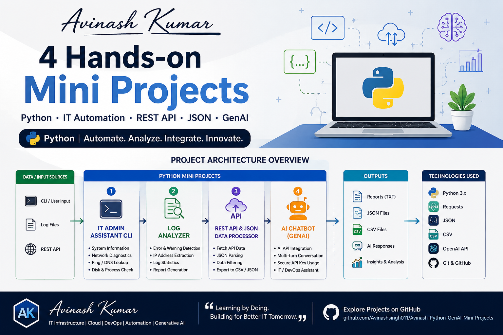

  

<h1 align="center">
4 Hands-on Mini Projects
</h1>

Python • IT Automation • REST API • JSON • GenAI

## 🚀 Projects

### 1. Python IT Admin Assistant CLI
System information, network diagnostics, ping/DNS lookup,
disk monitoring and process inspection.

### 2. Python Log Analyzer
Analyzes log files for errors, warnings, IP addresses
and generates automated reports.

### 3. REST API & JSON Data Processor
Consumes REST APIs, processes JSON data and exports
structured CSV/JSON reports.

### 4. Python GenAI IT Assistant
AI-powered command-line assistant with multi-turn
conversation and secure API integration.
